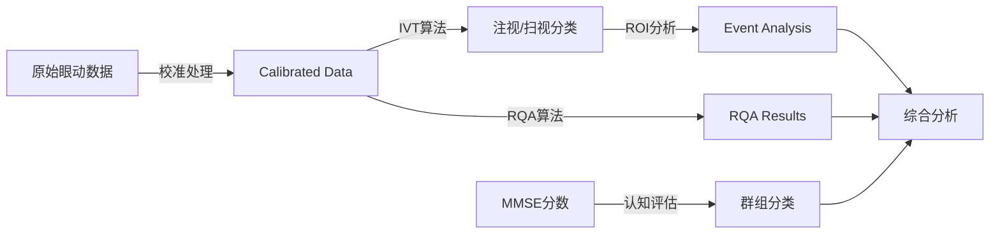

# 眼动数据分析系统 - 数据结构完整文档

## 📋 文档概述

本文档详细记录了眼动数据分析系统中所有数据文件的结构、位置、公式和关联关系，为进一步开发和扩展提供全面的技术文档支持。

## 📁 数据目录结构

```
data/
├── ad_calibrated/          # AD患者校准数据
├── mci_calibrated/         # MCI患者校准数据  
├── control_calibrated/     # 控制组校准数据
├── MMSE_Score/             # MMSE认知评分数据
├── event_analysis_results/ # 事件分析结果
├── rqa_pipeline_results/   # RQA管道分析结果
├── feature_extraction_results/ # 特征提取结果
└── background_images/      # 背景图片资源
```

---

## 🧠 1. MMSE认知评分数据

### 📍 数据位置
- **文件夹**: `data/MMSE_Score/`
- **文件列表**:
  - `阿尔兹海默症组.csv` (AD组，26行)
  - `轻度认知障碍组.csv` (MCI组，26行)
  - `控制组.csv` (正常对照组，26行)

### 📊 数据结构

| 字段名 | 数据类型 | 描述 | 取值范围 |
|--------|----------|------|----------|
| 受试者/试者 | String | 被试ID (如ad01, M01, n01) | 固定格式 |
| 年份 | Integer | 时间定向-年份 | 0-1 |
| 季节 | Integer | 时间定向-季节 | 0-1 |
| 月份 | Integer | 时间定向-月份 | 0-1 |
| 星期 | Integer | 时间定向-星期 | 0-2 |
| 省市区 | Integer | 地点定向-省市区 | 0-2 |
| 街道 | Integer | 地点定向-街道 | 0-1 |
| 建筑 | Integer | 地点定向-建筑 | 0-1 |
| 楼层 | Integer | 地点定向-楼层 | 0-1 |
| 即刻记忆 | Integer | 即刻记忆测试 | 0-3 |
| 100-7 | Integer | 注意力计算-第1步 | 0-1 |
| 93-7 | Integer | 注意力计算-第2步 | 0-1 |
| 86-7 | Integer | 注意力计算-第3步 | 0-1 |
| 79-7 | Integer | 注意力计算-第4步 | 0-1 |
| 72-7 | Integer | 注意力计算-第5步 | 0-1 |
| 词1 | Integer | 延迟回忆-第1个词 | 0-1 |
| 词2 | Integer | 延迟回忆-第2个词 | 0-1 |
| 词3 | Integer | 延迟回忆-第3个词 | 0-1 |
| 总分 | Integer | MMSE总分 | 0-21 |

### 🔢 转换公式

**VR-MMSE到标准MMSE转换公式**:
```
标准MMSE分数 = (VR-MMSE分数 / 21) × 30
```

### 📈 统计信息

| 组别 | 样本数 | 平均分 | 标准差 | 分数范围 |
|------|--------|--------|--------|----------|
| AD组 | 20 | 10.9 | 1.6 | 7-13 |
| MCI组 | 20 | 17.3 | 1.5 | 15-20 |
| 控制组 | 20 | 19.1 | 1.4 | 16-21 |

---

## 👁️ 2. 校准眼动数据 (Calibrated Eye-tracking Data)

### 📍 数据位置
- **AD组**: `data/ad_calibrated/ad_group_[1-22]/`
- **MCI组**: `data/mci_calibrated/mci_group_[1-20]/`
- **控制组**: `data/control_calibrated/control_group_[1-20]/`

### 📊 数据结构

**文件命名规则**: `[group][id]q[task]_preprocessed_calibrated.csv`
- group: ad/m/n (AD/MCI/Normal)
- id: 受试者编号
- task: 任务编号 (1-5)

| 字段名 | 数据类型 | 单位 | 描述 |
|--------|----------|------|------|
| x | Float | 归一化坐标 | 屏幕X坐标 (0-1) |
| y | Float | 归一化坐标 | 屏幕Y坐标 (0-1) |
| z | Float | 归一化坐标 | 深度坐标 (通常为0) |
| abs_datetime | DateTime | - | 绝对时间戳 |
| milliseconds | Float | ms | 相对毫秒数 |
| time_diff | Float | ms | 时间间隔 |
| x_deg | Float | 度 | X轴视角度数 |
| y_deg | Float | 度 | Y轴视角度数 |
| x_deg_diff | Float | 度 | X轴角度变化 |
| y_deg_diff | Float | 度 | Y轴角度变化 |
| dist_deg | Float | 度 | 角度距离 |
| velocity_deg_s | Float | 度/秒 | 瞬时角速度 |
| avg_velocity_deg_s | Float | 度/秒 | 平均角速度 |

### 🧮 计算公式

**角度计算公式**:
```python
# 屏幕坐标到视角度数转换
x_deg = (x - 0.5) * FOV_X  # FOV_X为水平视场角
y_deg = (0.5 - y) * FOV_Y  # FOV_Y为垂直视场角

# 角速度计算
velocity_deg_s = dist_deg / (time_diff / 1000.0)
```

**距离计算公式**:
```python
import math
dist_deg = math.sqrt(x_deg_diff**2 + y_deg_diff**2)
```

### 📏 数据规模
- **AD组**: 100个文件 (20受试者 × 5任务)
- **MCI组**: 100个文件 (20受试者 × 5任务)  
- **控制组**: 100个文件 (20受试者 × 5任务)
- **总计**: 300个校准数据文件

---

## 📊 3. 事件分析结果 (Event Analysis Results)

### 📍 数据位置
- **文件夹**: `data/event_analysis_results/`
- **主要文件**:
  - `All_Events.csv` (1.2MB, 全部事件数据)
  - `All_ROI_Summary.csv` (64KB, 1649行, ROI汇总数据)
  - 分组文件: `[group]_All_Events.csv`, `[group]_All_ROI_Summary.csv`

### 📊 事件数据结构 (All_Events.csv)

| 字段名 | 数据类型 | 描述 | 示例值 |
|--------|----------|------|--------|
| ADQ_ID | String | 任务唯一标识符 | n1q1, ad3q2 |
| EventType | String | 事件类型 | fixation, saccade |
| StartIndex | Integer | 起始数据点索引 | 0, 6, 13 |
| EndIndex | Integer | 结束数据点索引 | 2, 8, 14 |
| Duration_ms | Float | 事件持续时间(毫秒) | 253.0, 244.0, 122.0 |
| Amplitude_deg | Float | 事件幅度(度) | 2.482674, 0.206290 |
| MaxVel | Float | 最大速度(度/秒) | 仅扫视事件有值 |
| MeanVel | Float | 平均速度(度/秒) | 仅扫视事件有值 |
| ROI | String | 关联的ROI区域 | INST_n2q1_1, KW_n2q1_2 |
| Group | String | 实验组别 | control, ad, mci |

### 📊 ROI汇总数据结构 (All_ROI_Summary.csv)

| 字段名 | 数据类型 | 描述 | 示例值 |
|--------|----------|------|--------|
| ADQ_ID | String | 任务唯一标识符 | n1q1, ad3q2 |
| ROI | String | 感兴趣区域名称 | KW_n2q1_4, INST_n2q1_1 |
| FixTime | Float | 注视总时长(秒) | 2.569, 0.612 |
| EnterCount | Integer | 进入次数 | 4, 1 |
| RegressionCount | Integer | 回视次数 | 3, 0 |
| Group | String | 实验组别 | control, ad, mci |

### 🎯 ROI命名规则

**ROI命名格式**: `[类型]_[任务ID]_[序号]`
- **KW**: 关键词区域
- **INST**: 指令区域  
- **BG**: 背景区域
- **任务ID**: 如n2q1 (正常组第2受试者第1题)

### 📈 计算指标

**事件检测算法 (IVT - I-VT Algorithm)**:
```python
# 速度阈值法检测注视和扫视
velocity_threshold = 40  # 度/秒

if velocity_deg_s < velocity_threshold:
    event_type = "fixation"
else:
    event_type = "saccade"
```

**注视效率指标**:
```python
# 注视效率 = 注视时长 / 进入次数
fixation_efficiency = FixTime / EnterCount

# 回视率 = 回视次数 / 进入次数  
regression_rate = RegressionCount / EnterCount

# 事件持续时间(秒) = 持续时间(毫秒) / 1000
duration_s = Duration_ms / 1000.0
```

### 📊 事件分析数据规模

| 文件类型 | 文件大小 | 记录数 | 描述 |
|----------|----------|--------|------|
| All_Events.csv | 1.2MB | ~18,000+ | 全部注视/扫视事件 |
| All_ROI_Summary.csv | 64KB | 1,649 | ROI汇总统计 |
| ad_All_Events.csv | 556KB | 8,364 | AD组事件数据 |
| mci_All_Events.csv | 441KB | 6,822 | MCI组事件数据 |
| control_All_Events.csv | 181KB | 2,880 | 控制组事件数据 |

---

## 🔄 4. RQA管道分析结果

### 📍 数据位置
- **基础路径**: `data/rqa_pipeline_results/m2_tau1_eps0.055_lmin2/`
- **步骤文件夹**:
  - `step1_rqa_calculation/` - RQA计算
  - `step2_data_merging/` - 数据合并  
  - `step3_feature_enrichment/` - 特征丰富化
  - `step4_statistical_analysis/` - 统计分析
  - `step5_visualization/` - 可视化

### 📊 Step1: RQA计算结果

**文件**: `RQA_1D2D_summary_[group].csv`

| 字段名 | 数据类型 | 描述 | 计算方法 |
|--------|----------|------|----------|
| filename | String | 源文件名 | - |
| folder | Integer | 文件夹编号 | - |
| q | Integer | 任务编号 (1-5) | - |
| RR-2D-xy | Float | 2D递归率 | 递归点数/总点数 |
| RR-1D-x | Float | 1D递归率(X轴) | X轴递归点数/总点数 |
| DET-2D-xy | Float | 2D确定性 | 对角线长度≥lmin的比例 |
| DET-1D-x | Float | 1D确定性(X轴) | X轴对角线确定性 |
| ENT-2D-xy | Float | 2D熵 | 对角线长度分布熵 |
| ENT-1D-x | Float | 1D熵(X轴) | X轴对角线长度熵 |

### 🧮 RQA计算公式

**递归率 (Recurrence Rate)**:
```python
RR = N_recurrent_points / N_total_points
```

**确定性 (Determinism)**:
```python
DET = sum(l * P(l) for l >= lmin) / sum(l * P(l) for all l)
# P(l) = 长度为l的对角线频率分布
# lmin = 最小线长阈值
```

**熵 (Entropy)**:
```python
ENT = -sum(P(l) * log(P(l)) for l >= lmin)
```

### 📊 Step2: 数据合并结果

**文件**: `All_Subjects_RQA_EyeMetrics.csv` (307行)

在RQA指标基础上增加:
| 字段名 | 描述 |
|--------|------|
| ID | 受试者任务ID (如n1q1) |
| Group | 实验组 (Control/AD/MCI) |

### 📊 Step3: 特征丰富化结果

**文件**: `All_Subjects_RQA_EyeMetrics_Filled.csv`
- 填充缺失值
- 添加派生特征
- 标准化处理

---

## 🔗 5. 数据关联关系

### 🔗 主键关联

**受试者ID关联**:
```
MMSE_Score: ad01, M01, n01
↓
Calibrated_Data: ad1q1, m1q1, n1q1  
↓
Event_Analysis: ad1q1, m1q1, n1q1
↓
RQA_Results: ad1q1, m1q1, n1q1
```

### 🔗 数据流转换



---

## 📝 6. 数据处理流程

### 🔄 预处理流程

1. **原始数据** → **校准数据**
   - 坐标系转换
   - 时间同步
   - 噪声过滤

2. **校准数据** → **事件数据**  
   - IVT速度阈值: 40°/s
   - 注视点识别
   - ROI映射

3. **校准数据** → **RQA数据**
   - 嵌入维度: m=2
   - 时间延迟: τ=1  
   - 递归阈值: ε=0.055
   - 最小线长: lmin=2

---

## 🎯 7. 关键指标定义

### 👁️ 眼动指标

| 指标类别 | 指标名称 | 计算公式 | 单位 |
|----------|----------|----------|------|
| 注视相关 | 注视次数 | count(fixations) | 次 |
| 注视相关 | 注视总时长 | sum(fixation_duration) | 秒 |
| 注视相关 | 平均注视时长 | 总时长/注视次数 | 秒 |
| 扫视相关 | 扫视幅度 | sqrt(dx²+dy²) | 度 |
| 扫视相关 | 扫视速度 | 距离/时间 | 度/秒 |
| 轨迹相关 | 扫描路径长度 | sum(saccade_amplitude) | 度 |
| ROI相关 | ROI停留时间 | sum(fixation_in_roi) | 秒 |
| ROI相关 | ROI访问次数 | count(roi_entries) | 次 |

### 🔄 RQA指标

| 指标名称 | 符号 | 含义 | 正常范围 |
|----------|------|------|----------|
| 递归率 | RR | 轨迹自相似程度 | 0.01-0.15 |
| 确定性 | DET | 轨迹规律性 | 0.65-0.95 |
| 熵 | ENT | 轨迹复杂度 | 1.0-3.5 |

---

## 📊 8. 数据质量控制

### ✅ 数据完整性检查

- **MMSE数据**: 3组 × 20受试者 = 60条记录 ✅
- **校准数据**: 3组 × 20受试者 × 5任务 = 300文件 ✅  
- **事件数据**: All_Events.csv (完整) ✅
- **RQA数据**: 307条记录 (完整) ✅

### 🔍 数据异常值检测

**眼动数据异常值标准**:
- 注视时长: > 2秒视为异常
- 扫视幅度: > 30度视为异常  
- 角速度: > 1000度/秒视为异常

**RQA异常值标准**:
- RR > 0.5 视为异常
- DET < 0.3 或 > 0.99 视为异常

---

## 🔧 9. 数据访问接口

### 📡 API端点

```python
# MMSE分数API
GET /api/mmse-scores/{group}  # group: ad/mci/control

# 眼动数据API  
GET /api/group/{group}/data   # 获取组数据
GET /api/visualize/{group}/{file_id}  # 可视化特定文件

# 事件分析API
GET /api/event-analysis/data  # 事件数据
GET /api/event-analysis/summary  # 统计摘要

# RQA分析API
GET /api/rqa-pipeline/results  # RQA结果
POST /api/rqa-pipeline/run     # 执行RQA分析
```

### 💾 文件操作工具

```python
# 数据加载函数
def load_mmse_scores(group):
    """加载MMSE分数数据"""
    
def load_calibrated_data(group, subject_id, task_id):
    """加载校准眼动数据"""
    
def load_event_analysis():
    """加载事件分析结果"""
    
def load_rqa_results(parameters):
    """加载RQA分析结果"""
```

---

## 📋 10. 使用示例

### 🔍 数据查询示例

```python
# 获取AD组MMSE平均分
ad_mmse = load_mmse_scores('ad')
ad_avg = ad_mmse['总分'].mean()  # 10.9

# 加载特定受试者数据
eye_data = load_calibrated_data('ad', 'ad01', 1)

# 计算注视指标
fixations = identify_fixations(eye_data, velocity_threshold=40)
fixation_count = len(fixations)
```

### 📊 数据分析示例

```python
# RQA参数设置
rqa_params = {
    'embedding_dim': 2,
    'time_delay': 1, 
    'recurrence_threshold': 0.055,
    'min_line_length': 2
}

# 计算RQA指标
rqa_results = calculate_rqa(eye_data, rqa_params)
print(f"递归率: {rqa_results['RR']:.4f}")
print(f"确定性: {rqa_results['DET']:.4f}")
```

---

## 📚 11. 参考文献与标准

### 📖 技术标准
- **IVT算法**: Salvucci & Goldberg (2000)
- **RQA方法**: Webber & Zbilut (1994) 
- **MMSE评估**: Folstein et al. (1975)

### 🔗 相关工具
- **PyGaze**: 眼动数据处理
- **PyRQA**: 递归量化分析
- **Pandas**: 数据操作
- **NumPy**: 数值计算

---

## ⚠️ 12. 注意事项

### 🚨 数据使用限制
1. **隐私保护**: 所有受试者数据已匿名化处理
2. **数据完整性**: 禁止修改原始校准数据
3. **计算精度**: RQA计算对参数敏感，需谨慎调整

### 🔧 性能优化建议
1. **大文件处理**: 使用分块读取处理大型事件数据
2. **并行计算**: RQA计算可并行化处理多个文件
3. **缓存策略**: 频繁访问的数据建议缓存

---

## 📝 13. 更新日志

| 版本 | 日期 | 更新内容 | 作者 |
|------|------|----------|------|
| 1.0 | 2025-07-31 | 初始版本，完整数据结构文档 | AI Assistant |

---

**文档编制**: AI Assistant  
**最后更新**: 2025年7月31日  
**文档状态**: 完整版本  

---

> 💡 **提示**: 本文档为眼动数据分析系统的核心技术文档，建议开发团队定期更新维护，确保与实际数据结构保持同步。