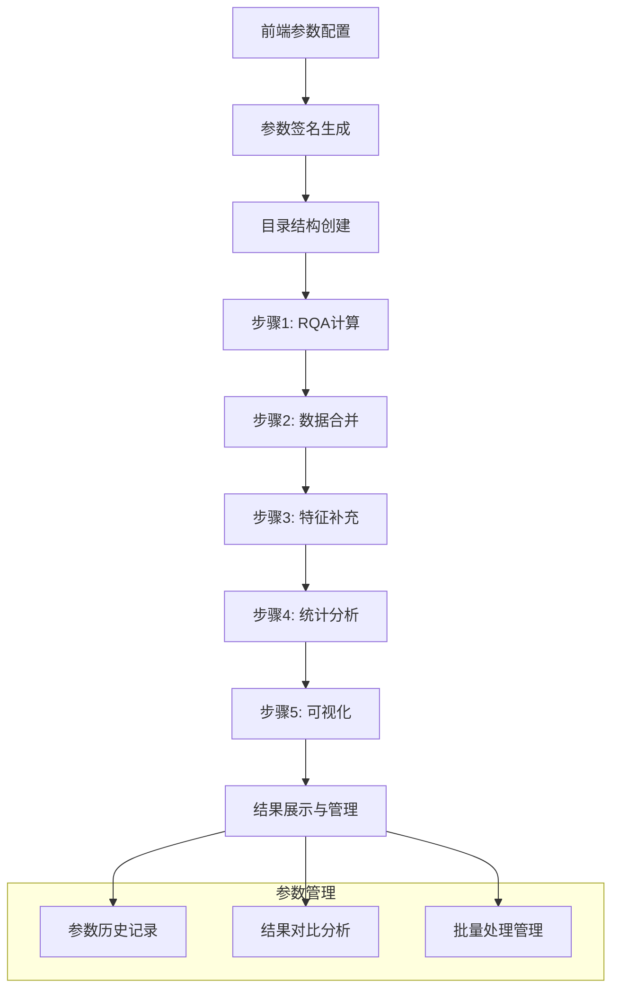
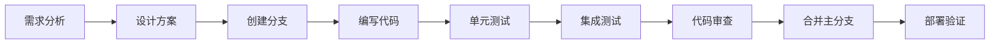

# 开发指南 (Development Guide)

## 📋 目录

1. [开发环境配置](#-开发环境配置)
2. [项目结构说明](#-项目结构说明)
3. [代码规范](#-代码规范)
4. [开发流程](#-开发流程)
5. [测试指南](#-测试指南)
6. [部署指南](#-部署指南)
7. [性能优化](#-性能优化)
8. [故障排除](#-故障排除)

---

## 🛠️ 开发环境配置

### 系统要求

- **操作系统**: Windows 10+, macOS 10.15+, Ubuntu 18.04+
- **Python**: 3.8+ (推荐 3.9)
- **内存**: 最少4GB，推荐8GB+
- **存储**: 至少2GB可用空间
- **浏览器**: Chrome 90+, Firefox 88+, Edge 90+

### 环境安装步骤

```bash
# 1. 克隆项目
git clone <repository-url>
cd az

# 2. 创建虚拟环境
python -m venv venv

# 3. 激活虚拟环境
# Windows
venv\Scripts\activate
# macOS/Linux  
source venv/bin/activate

# 4. 安装依赖
pip install -r requirements.txt

# 5. 验证安装
python -c "import flask, numpy, pandas, matplotlib; print('✅ 依赖安装成功')"

# 6. 启动开发服务器
python start_server.py
```

### 开发工具推荐

- **IDE**: PyCharm Professional, VS Code
- **代码格式化**: Black, autopep8
- **代码检查**: pylint, flake8
- **API测试**: Postman, Insomnia
- **版本控制**: Git + GitHub/GitLab
- **文档编写**: Markdown编辑器

---

## 📁 项目结构说明

### 核心目录结构

```
az/
├── 📂 analysis/                    # 🔬 核心分析模块
│   ├── rqa_batch_renderer.py      # RQA批量渲染 (核心类: 2000+ 行)
│   ├── time_calibration.py        # 时间校准算法
│   ├── data_processor.py          # 数据预处理逻辑
│   └── event_analyzer.py          # 眼动事件分析
├── 📂 visualization/               # 🎨 可视化和API
│   ├── rqa_api_extension.py       # RQA相关API接口
│   ├── rqa_pipeline_api.py        # 🆕 RQA分析流程API (完整pipeline)
│   ├── web_api.py                 # 基础Web API
│   ├── enhanced_web_visualizer.py # 主Web服务器
│   └── templates/
│       └── enhanced_index.html    # 前端界面 (6000+ 行，含第五模块)
├── 📂 data/                       # 💾 数据存储
│   ├── *_calibrated/              # 校准后数据
│   ├── event_analysis_results/    # 事件分析结果
│   ├── rqa_results/               # RQA渲染结果
│   └── rqa_pipeline_results/      # 🆕 参数化RQA分析流程结果
│       └── m{m}_tau{τ}_eps{ε}_lmin{l}/  # 参数签名目录
│           ├── step1_rqa_calculation/   # 步骤1：RQA计算
│           ├── step2_data_merging/      # 步骤2：数据合并
│           ├── step3_feature_enrichment/ # 步骤3：特征补充
│           ├── step4_statistical_analysis/ # 步骤4：统计分析
│           ├── step5_visualization/     # 步骤5：可视化
│           └── metadata.json           # 参数元数据
├── 📂 config/                     # ⚙️ 配置文件
│   ├── config.py                  # 主配置
│   └── *.json                     # JSON配置文件
└── 📂 utils/                      # 🛠️ 工具脚本
    └── *.py                       # 各种工具函数
```

### 关键文件说明

| 文件 | 行数 | 功能 | 维护难度 |
|------|------|------|----------|
| `rqa_batch_renderer.py` | 2000+ | RQA分析核心逻辑 | ⭐⭐⭐⭐⭐ |
| `rqa_pipeline_api.py` | 1200+ | 🆕 RQA完整分析流程 | ⭐⭐⭐⭐⭐ |
| `enhanced_index.html` | 6000+ | 前端主界面(含第五模块) | ⭐⭐⭐⭐ |
| `rqa_api_extension.py` | 500+ | RQA API接口 | ⭐⭐⭐ |
| `web_api.py` | 800+ | 基础API服务 | ⭐⭐⭐ |
| `time_calibration.py` | 300+ | 时间校准 | ⭐⭐ |

---

## 🔄 第五模块：RQA参数化分析流程

### 模块概述

第五模块是一个**完整的眼动数据RQA分析流程**，实现了从原始数据处理到统计分析再到可视化的全自动化pipeline。该模块的核心特点是**参数化管理**，支持不同RQA参数组合的并行分析和结果对比。

### 核心架构



### 关键技术特性

#### 1. 参数化管理系统
```python
def generate_param_signature(params):
    """生成参数签名用于目录管理"""
    m = params.get('m', 2)
    tau = params.get('tau', 1)
    eps = params.get('eps', 0.05)
    lmin = params.get('lmin', 2)
    return f"m{m}_tau{tau}_eps{eps}_lmin{lmin}"

# 目录结构示例
# data/rqa_pipeline_results/
# ├── m2_tau1_eps0.05_lmin2/     # 参数组合1
# ├── m3_tau2_eps0.08_lmin3/     # 参数组合2
# └── m2_tau1_eps0.03_lmin2/     # 参数组合3
```

#### 2. 五步骤分析流程

**步骤1: RQA计算**
- 文件: `rqa_pipeline_api.py` - `rqa_calculate()`
- 功能: 对所有数据文件执行RQA分析
- 输出: `RQA_1D2D_summary_{group}.csv`

**步骤2: 数据合并**
- 文件: `rqa_pipeline_api.py` - `data_merge()`
- 功能: 合并三组数据(Control/MCI/AD)
- 输出: `All_Subjects_RQA_EyeMetrics.csv`

**步骤3: 特征补充**
- 文件: `rqa_pipeline_api.py` - `feature_enrichment()`
- 功能: 补充眼动事件特征和ROI统计
- 输出: `All_Subjects_RQA_EyeMetrics_Filled.csv`

**步骤4: 统计分析**
- 文件: `rqa_pipeline_api.py` - `statistical_analysis()`
- 功能: 多层次统计分析
- 输出: `group_stats_output.csv`, `multi_level_stats_output.csv`

**步骤5: 可视化**
- 文件: `rqa_pipeline_api.py` - `create_visualization()`
- 功能: 生成统计图表和趋势分析
- 输出: PNG图表文件 + JSON数据

#### 3. 数据兼容性处理

```python
# 灵活的列名映射机制
col_mapping = {
    'Duration_ms': ['Duration_ms', 'duration_ms', 'Duration'],
    'Amplitude': ['Amplitude_deg', 'SaccadeAmplitude', 'amplitude'],
    'FixationDuration': ['FixationDuration', 'FixTime', 'fixation_duration']
}

def build_event_aggregates(events_csv_path):
    """构造事件级聚合，支持多种列名格式"""
    # 自动检测和映射列名
    actual_cols = {}
    for key, possible_names in col_mapping.items():
        for name in possible_names:
            if name in available_cols:
                actual_cols[key] = name
                break
```

#### 4. 可视化增强

**组级条形图**
- 支持 RR-2D-xy, DET-2D-xy, ENT-2D-xy 指标
- 自动生成均值±标准差图表
- 统一的颜色主题

**任务间趋势图**
- "Average RR (2D-xy) across tasks by Group"
- 支持标准差区域显示
- 样本数量标注

```python
def create_task_trend_chart(df, metric="RR-2D-xy"):
    """创建任务间变化折线图"""
    colors = {'Control': '#4472C4', 'MCI': '#E15759', 'AD': '#70AD47'}
    
    # 计算组级统计
    avg_by_group = df_clean.groupby(['Group', 'q'])[metric].agg(['mean', 'std', 'count'])
    
    # 绘制趋势线和标准差区域
    for group in ['Control', 'MCI', 'AD']:
        group_data = avg_by_group[avg_by_group['Group'] == group]
        plt.plot(group_data['q'], group_data['mean'], 
                marker='o', label=f'{group} (n≈{total_count:.0f})', 
                color=colors[group])
        plt.fill_between(group_data['q'],
                        group_data['mean'] - group_data['std'],
                        group_data['mean'] + group_data['std'],
                        color=colors[group], alpha=0.2)
```

### 前端界面设计

#### 1. 参数配置面板
```html
<div class="rqa-parameter-config">
    <div class="param-row">
        <label>嵌入维度 (m):</label>
        <input type="number" id="rqa-m" value="2" min="1" max="10">
    </div>
    <div class="param-row">
        <label>时间延迟 (τ):</label>
        <input type="number" id="rqa-tau" value="1" min="1" max="10">
    </div>
    <!-- 参数签名显示 -->
    <div class="param-signature">
        当前参数: <span id="param-display">m2_tau1_eps0.05_lmin2</span>
    </div>
</div>
```

#### 2. 五步骤进度指示器
```javascript
function updateStepStatus(stepNumber, status) {
    const stepElement = document.getElementById(`step${stepNumber}`);
    stepElement.className = `pipeline-step ${status}`;
    
    const statusText = {
        'pending': '等待中',
        'running': '运行中...',
        'completed': '已完成',
        'error': '失败'
    };
    
    stepElement.querySelector('.step-status').textContent = statusText[status];
}
```

#### 3. 历史参数管理
```javascript
async function loadParamHistory() {
    const response = await fetch('/api/rqa-pipeline/param-history');
    const data = await response.json();
    
    const historyList = document.getElementById('param-history-list');
    historyList.innerHTML = '';
    
    data.data.forEach(item => {
        const historyItem = document.createElement('div');
        historyItem.innerHTML = `
            <div class="history-item">
                <span class="signature">${item.signature}</span>
                <span class="progress">${item.progress.toFixed(1)}%</span>
                <button onclick="loadParams('${item.signature}')">加载</button>
                <button onclick="viewResults('${item.signature}')">查看</button>
                <button onclick="deleteResults('${item.signature}')">删除</button>
            </div>
        `;
        historyList.appendChild(historyItem);
    });
}
```

### API接口设计

#### 核心API端点

| 端点 | 方法 | 功能 | 参数 |
|------|------|------|------|
| `/api/rqa-pipeline/calculate` | POST | 步骤1：RQA计算 | `{parameters: {m, tau, eps, lmin}}` |
| `/api/rqa-pipeline/merge` | POST | 步骤2：数据合并 | `{parameters: {...}}` |
| `/api/rqa-pipeline/enrich` | POST | 步骤3：特征补充 | `{parameters: {...}}` |
| `/api/rqa-pipeline/analyze` | POST | 步骤4：统计分析 | `{parameters: {...}}` |
| `/api/rqa-pipeline/visualize` | POST | 步骤5：可视化 | `{parameters: {...}}` |
| `/api/rqa-pipeline/status` | GET | 获取流程状态 | `?m=2&tau=1&eps=0.05&lmin=2` |
| `/api/rqa-pipeline/param-history` | GET | 参数历史记录 | 无 |
| `/api/rqa-pipeline/results/<signature>` | GET | 获取特定结果 | URL参数 |
| `/api/rqa-pipeline/delete/<signature>` | DELETE | 删除结果 | URL参数 |

#### 响应格式标准

```json
{
    "status": "success",
    "message": "RQA计算完成",
    "data": {
        "param_signature": "m2_tau1_eps0.05_lmin2",
        "total_files": 305,
        "control_files": 100,
        "mci_files": 105,
        "ad_files": 100,
        "output_directory": "data/rqa_pipeline_results/m2_tau1_eps0.05_lmin2/step1_rqa_calculation"
    }
}
```

### 性能优化策略

#### 1. 内存管理
```python
def process_rqa_with_memory_management(file_paths, parameters):
    """内存优化的RQA处理"""
    for file_path in file_paths:
        try:
            result = process_single_rqa_file(file_path, **parameters)
            yield result
        finally:
            # 强制垃圾回收
            import gc
            gc.collect()
            # 清理matplotlib图形
            plt.close('all')
```

#### 2. 批量处理优化
```python
# 分批处理大数据集
BATCH_SIZE = 50
for i in range(0, len(files), BATCH_SIZE):
    batch_files = files[i:i+BATCH_SIZE]
    batch_results = process_batch(batch_files)
    save_batch_results(batch_results)
```

#### 3. 异步处理
```javascript
// 前端异步状态监控
async function monitorPipelineProgress() {
    const checkInterval = 2000; // 2秒检查一次
    
    while (pipelineRunning) {
        try {
            const response = await fetch(`/api/rqa-pipeline/status?${currentParams}`);
            const status = await response.json();
            updateProgressUI(status);
            await sleep(checkInterval);
        } catch (error) {
            console.error('状态检查失败:', error);
            break;
        }
    }
}
```

### 故障排除

#### 常见问题与解决方案

**问题1: 参数目录创建失败**
```python
# 确保目录权限正确
import os
import stat

def ensure_directory_permissions(directory):
    if not os.path.exists(directory):
        os.makedirs(directory, mode=0o755)
    else:
        os.chmod(directory, stat.S_IRWXU | stat.S_IRGRP | stat.S_IXGRP)
```

**问题2: 列名兼容性问题**
```python
# 添加调试信息
def debug_column_mapping(df_path):
    df = pd.read_csv(df_path)
    print(f"可用列: {df.columns.tolist()}")
    
    # 检查每个映射
    for key, possible_names in col_mapping.items():
        found = [name for name in possible_names if name in df.columns]
        print(f"{key}: 找到 {found}")
```

**问题3: 可视化matplotlib错误**
```python
# 图例兼容性修复
try:
    legend = plt.legend(title="Cognitive Groups", loc='best')
    legend.get_title().set_fontweight('bold')
except TypeError:
    # 降级处理
    plt.legend(title="Cognitive Groups", loc='best')
```

---

## 📝 代码规范

### Python代码规范

#### 1. 命名规范

```python
# ✅ 好的命名
class RQABatchRenderer:
    def __init__(self):
        self.embedding_dimension = 2
        self.recurrence_threshold = 0.05
    
    def compute_recurrence_matrix(self, signal_data):
        distance_matrix = self._calculate_distances(signal_data)
        return distance_matrix < self.recurrence_threshold
    
    def _calculate_distances(self, data):
        """私有方法使用下划线前缀"""
        pass

# ❌ 不好的命名
class rqa_renderer:
    def __init__(self):
        self.m = 2
        self.eps = 0.05
    
    def compute_RM(self, data):
        dm = self.calc_dist(data)
        return dm < self.eps
```

#### 2. 函数设计

```python
# ✅ 好的函数设计
def plot_amplitude_with_roi_enhanced(
    self, 
    data_id: str, 
    signal_data: np.ndarray, 
    t_: np.ndarray, 
    df: pd.DataFrame, 
    roi_color_dict: Dict[str, Tuple[float, float, float]], 
    params: Dict[str, Any], 
    save_path: str, 
    events_dict: Dict[str, List[Dict]]
) -> Optional[str]:
    """
    生成增强的amplitude图，包含ROI着色和标注
    
    Args:
        data_id: 数据标识符
        signal_data: 信号数据数组
        t_: 时间数组
        df: 原始数据DataFrame
        roi_color_dict: ROI颜色映射字典
        params: 渲染参数
        save_path: 保存路径
        events_dict: 事件数据字典
        
    Returns:
        base64编码的图片字符串，失败时返回None
        
    Raises:
        ValueError: 当信号数据格式不正确时
        IOError: 当无法保存图片时
    """
    # 实现逻辑...
    pass

# ❌ 不好的函数设计
def plot_amp(self, did, data, t, df, colors, p, path, events):
    # 没有类型注解，没有文档说明
    pass
```

#### 3. 错误处理

```python
# ✅ 好的错误处理
def load_and_validate_data(self, file_path: str) -> pd.DataFrame:
    """加载并验证CSV数据文件"""
    try:
        if not os.path.exists(file_path):
            raise FileNotFoundError(f"数据文件不存在: {file_path}")
            
        df = pd.read_csv(file_path)
        
        # 验证必需列
        required_columns = ['timestamp', 'x', 'y']
        missing_columns = [col for col in required_columns if col not in df.columns]
        if missing_columns:
            raise ValueError(f"缺少必需列: {missing_columns}")
            
        # 数据类型验证
        df['x'] = pd.to_numeric(df['x'], errors='coerce')
        df['y'] = pd.to_numeric(df['y'], errors='coerce')
        
        return df
        
    except pd.errors.EmptyDataError:
        print(f"❌ 数据文件为空: {file_path}")
        return pd.DataFrame()
    except Exception as e:
        print(f"❌ 加载数据失败 {file_path}: {e}")
        return pd.DataFrame()

# ❌ 不好的错误处理
def load_data(self, path):
    df = pd.read_csv(path)  # 可能抛出异常但没有处理
    return df
```

### JavaScript代码规范

#### 1. 变量声明和命名

```javascript
// ✅ 好的JavaScript代码
const RQA_CONFIG = {
    DEFAULT_EMBEDDING_DIMENSION: 2,
    DEFAULT_TIME_DELAY: 1,
    DEFAULT_THRESHOLD: 0.05
};

class RQAInterface {
    constructor() {
        this.currentParamSignature = '';
        this.renderingInProgress = false;
        this.resultsCache = new Map();
    }
    
    async startRQARendering(parameters) {
        try {
            this.renderingInProgress = true;
            this.updateUI('rendering');
            
            const response = await fetch('/api/rqa-batch-render', {
                method: 'POST',
                headers: {'Content-Type': 'application/json'},
                body: JSON.stringify(parameters)
            });
            
            if (!response.ok) {
                throw new Error(`HTTP ${response.status}: ${response.statusText}`);
            }
            
            const result = await response.json();
            this.currentParamSignature = result.param_signature;
            this.monitorProgress();
            
        } catch (error) {
            console.error('RQA渲染启动失败:', error);
            this.showError('启动渲染失败: ' + error.message);
        } finally {
            this.renderingInProgress = false;
        }
    }
}

// ❌ 不好的JavaScript代码
var config = {
    m: 2,
    tau: 1,
    eps: 0.05
};

function startRender(params) {
    // 没有错误处理
    fetch('/api/rqa-batch-render', {
        method: 'POST',
        body: JSON.stringify(params)
    }).then(response => response.json())
    .then(data => {
        // 处理响应
    });
}
```

### HTML/CSS规范

```html
<!-- ✅ 好的HTML结构 -->
<div class="rqa-analysis-panel" id="rqa-analysis-panel">
    <div class="rqa-compact-filters">
        <div class="filters-grid">
            <div class="filter-item">
                <label for="rqa-analysis-mode" class="form-label">分析模式:</label>
                <select id="rqa-analysis-mode" class="form-select">
                    <option value="1d_x">1D信号 (X坐标)</option>
                    <option value="1d_amplitude">1D信号 (幅度)</option>
                    <option value="2d_xy" selected>2D信号 (X,Y坐标)</option>
                </select>
            </div>
        </div>
    </div>
</div>

<!-- CSS样式 -->
<style>
.rqa-compact-filters {
    background-color: #f8f9fa;
    border: 1px solid #dee2e6;
    border-radius: 8px;
    padding: 1rem;
    margin-bottom: 1rem;
}

.filters-grid {
    display: grid;
    grid-template-columns: repeat(auto-fit, minmax(200px, 1fr));
    gap: 1rem;
    align-items: end;
}
</style>
```

---

## 🔄 开发流程

### 1. 功能开发流程



### 2. Git工作流

```bash
# 1. 创建功能分支
git checkout -b feature/new-rqa-metric
git push -u origin feature/new-rqa-metric

# 2. 开发过程中的提交
git add .
git commit -m "feat: 添加新的RQA指标LAM计算"
git push origin feature/new-rqa-metric

# 3. 功能完成后
git checkout main
git pull origin main
git checkout feature/new-rqa-metric
git rebase main
git push origin feature/new-rqa-metric

# 4. 创建Pull Request
# 通过Web界面创建PR，进行代码审查

# 5. 合并后清理
git checkout main
git pull origin main
git branch -d feature/new-rqa-metric
git push origin --delete feature/new-rqa-metric
```

### 3. 提交信息规范

```bash
# 格式: <type>(<scope>): <subject>

# 类型 (type)
feat:     新功能
fix:      修复bug
docs:     文档更新
style:    代码格式调整
refactor: 重构代码
test:     测试相关
chore:    构建/工具相关

# 示例
feat(rqa): 添加LAM递归量化指标
fix(visualization): 修复amplitude图ROI着色问题
docs(api): 更新RQA API文档
style(frontend): 统一JavaScript代码格式
refactor(analysis): 重构信号嵌入算法
test(rqa): 添加递归矩阵计算单元测试
chore(deps): 更新依赖包版本
```

---

## 🧪 测试指南

### 1. 单元测试

```python
# tests/test_rqa_renderer.py
import unittest
import numpy as np
import pandas as pd
from analysis.rqa_batch_renderer import RQABatchRenderer

class TestRQABatchRenderer(unittest.TestCase):
    
    def setUp(self):
        """测试前的准备工作"""
        self.renderer = RQABatchRenderer()
        self.sample_data = pd.DataFrame({
            'timestamp': [0, 16, 32, 48, 64],
            'x': [100, 105, 110, 108, 103],
            'y': [200, 205, 210, 208, 203],
            'milliseconds': [0, 16, 32, 48, 64],
            'ROI': ['BG', 'INST', 'INST', 'KW', 'BG'],
            'SequenceID': [0, 1, 1, 2, 0]
        })
    
    def test_prepare_signal_data_1d_x(self):
        """测试1D X坐标信号准备"""
        signal = self.renderer.prepare_signal_data(self.sample_data, '1d_x')
        expected = np.array([100, 105, 110, 108, 103])
        np.testing.assert_array_equal(signal, expected)
    
    def test_prepare_signal_data_2d_xy(self):
        """测试2D XY坐标信号准备"""
        signal = self.renderer.prepare_signal_data(self.sample_data, '2d_xy')
        expected = np.array([[100, 200], [105, 205], [110, 210], [108, 208], [103, 203]])
        np.testing.assert_array_equal(signal, expected)
    
    def test_embed_signal_1d(self):
        """测试1D信号嵌入"""
        signal = np.array([1, 2, 3, 4, 5])
        embedded = self.renderer.embed_signal(signal, m=2, tau=1, mode='1d')
        expected = np.array([[1, 2], [2, 3], [3, 4], [4, 5]])
        np.testing.assert_array_equal(embedded, expected)
    
    def test_compute_recurrence_matrix(self):
        """测试递归矩阵计算"""
        embedded = np.array([[1, 2], [2, 3], [3, 4], [4, 5]])
        rm = self.renderer.compute_recurrence_matrix(embedded, epsilon=2.0, metric='euclidean')
        self.assertEqual(rm.shape, (4, 4))
        self.assertTrue(np.all(rm.diagonal()))  # 对角线应该全为True

if __name__ == '__main__':
    unittest.main()
```

### 2. API测试

```python
# tests/test_api.py
import unittest
import requests
import json
from time import sleep

class TestRQAAPI(unittest.TestCase):
    
    BASE_URL = "http://localhost:8080"
    
    def setUp(self):
        """确保服务器运行"""
        try:
            response = requests.get(f"{self.BASE_URL}/api/system/status", timeout=5)
            self.assertTrue(response.status_code == 200)
        except requests.ConnectionError:
            self.skipTest("服务器未运行")
    
    def test_start_rqa_rendering(self):
        """测试RQA渲染启动"""
        params = {
            "analysis_mode": "2d_xy",
            "distance_metric": "euclidean",
            "embedding_dimension": 2,
            "time_delay": 1,
            "recurrence_threshold": 0.05,
            "min_line_length": 2,
            "color_theme": "green_gradient"
        }
        
        response = requests.post(
            f"{self.BASE_URL}/api/rqa-batch-render",
            json=params,
            timeout=30
        )
        
        self.assertEqual(response.status_code, 200)
        data = response.json()
        self.assertEqual(data['status'], 'success')
        self.assertIn('param_signature', data)
    
    def test_get_render_status(self):
        """测试渲染状态获取"""
        response = requests.get(f"{self.BASE_URL}/api/rqa-render-status", timeout=10)
        self.assertEqual(response.status_code, 200)
        
        data = response.json()
        self.assertIn('status', data)
        self.assertIn('total_files', data)
        self.assertIn('processed_files', data)

class TestRQAPipelineAPI(unittest.TestCase):
    """第五模块：RQA分析流程API测试"""
    
    BASE_URL = "http://localhost:8080"
    TEST_PARAMS = {
        "m": 2,
        "tau": 1, 
        "eps": 0.05,
        "lmin": 2
    }
    
    def setUp(self):
        """测试前准备"""
        self.param_signature = "m2_tau1_eps0.05_lmin2"
    
    def test_rqa_pipeline_calculate(self):
        """测试步骤1：RQA计算"""
        response = requests.post(
            f"{self.BASE_URL}/api/rqa-pipeline/calculate",
            json={"parameters": self.TEST_PARAMS},
            timeout=60
        )
        
        self.assertEqual(response.status_code, 200)
        data = response.json()
        self.assertEqual(data['status'], 'success')
        self.assertIn('param_signature', data['data'])
        self.assertIn('total_files', data['data'])
    
    def test_rqa_pipeline_status(self):
        """测试流程状态查询"""
        response = requests.get(
            f"{self.BASE_URL}/api/rqa-pipeline/status",
            params=self.TEST_PARAMS,
            timeout=10
        )
        
        self.assertEqual(response.status_code, 200)
        data = response.json()
        self.assertIn('step_status', data['data'])
        self.assertIn('progress_percentage', data['data'])
    
    def test_param_history(self):
        """测试参数历史记录"""
        response = requests.get(
            f"{self.BASE_URL}/api/rqa-pipeline/param-history",
            timeout=10
        )
        
        self.assertEqual(response.status_code, 200)
        data = response.json()
        self.assertIn('data', data)
        self.assertIsInstance(data['data'], list)
    
    def test_visualization_results(self):
        """测试可视化结果获取"""
        response = requests.get(
            f"{self.BASE_URL}/api/rqa-pipeline/results/{self.param_signature}",
            timeout=10
        )
        
        if response.status_code == 200:
            data = response.json()
            self.assertIn('data', data)
            if 'results' in data['data'] and 'charts' in data['data']['results']:
                charts = data['data']['results']['charts']
                self.assertIsInstance(charts, list)
                # 验证图表数据结构
                if charts:
                    chart = charts[0]
                    self.assertIn('title', chart)
                    self.assertIn('metric', chart)
                    self.assertIn('image', chart)  # base64图片数据
        elif response.status_code == 404:
            self.skipTest(f"参数组合 {self.param_signature} 的结果不存在")
    
    def test_full_pipeline_integration(self):
        """集成测试：完整流程"""
        steps = [
            ('calculate', '步骤1：RQA计算'),
            ('merge', '步骤2：数据合并'), 
            ('enrich', '步骤3：特征补充'),
            ('analyze', '步骤4：统计分析'),
            ('visualize', '步骤5：可视化')
        ]
        
        for step_name, step_desc in steps:
            with self.subTest(step=step_name):
                response = requests.post(
                    f"{self.BASE_URL}/api/rqa-pipeline/{step_name}",
                    json={"parameters": self.TEST_PARAMS},
                    timeout=120  # 增加超时时间
                )
                
                # 检查响应
                if response.status_code == 200:
                    data = response.json()
                    self.assertEqual(data['status'], 'success')
                    print(f"✅ {step_desc} 测试通过")
                elif response.status_code == 500:
                    # 打印错误信息用于调试
                    try:
                        error_data = response.json()
                        print(f"❌ {step_desc} 失败: {error_data.get('message', '未知错误')}")
                    except:
                        print(f"❌ {step_desc} 失败: HTTP 500")
                    self.fail(f"{step_desc} 返回500错误")
                else:
                    self.fail(f"{step_desc} 返回状态码: {response.status_code}")

if __name__ == '__main__':
    unittest.main()
```

### 3. 运行测试

```bash
# 运行所有测试
python -m pytest tests/ -v

# 运行特定测试文件
python -m pytest tests/test_rqa_renderer.py -v

# 运行测试并生成覆盖率报告
python -m pytest tests/ --cov=analysis --cov-report=html

# 运行性能测试
python -m pytest tests/test_performance.py -v --benchmark-only
```

---

## 🚀 部署指南

### 1. 本地部署

```bash
# 1. 环境准备
python -m venv production_env
source production_env/bin/activate  # Linux/Mac
# 或 production_env\Scripts\activate  # Windows

# 2. 安装依赖
pip install -r requirements.txt

# 3. 环境变量配置
export FLASK_ENV=production
export FLASK_APP=start_server.py

# 4. 启动服务
python start_server.py
```

### 2. Docker部署

```dockerfile
# Dockerfile
FROM python:3.9-slim

WORKDIR /app

# 安装系统依赖
RUN apt-get update && apt-get install -y \
    gcc \
    g++ \
    && rm -rf /var/lib/apt/lists/*

# 复制依赖文件
COPY requirements.txt .
RUN pip install --no-cache-dir -r requirements.txt

# 复制项目文件
COPY . .

# 创建数据目录
RUN mkdir -p data/rqa_results

# 暴露端口
EXPOSE 8080

# 启动命令
CMD ["python", "start_server.py"]
```

```yaml
# docker-compose.yml
version: '3.8'

services:
  eyetracking-analysis:
    build: .
    ports:
      - "8080:8080"
    volumes:
      - ./data:/app/data
      - ./config:/app/config
    environment:
      - FLASK_ENV=production
    restart: unless-stopped
    
  # 可选：添加数据库
  postgres:
    image: postgres:13
    environment:
      POSTGRES_DB: eyetracking
      POSTGRES_USER: user
      POSTGRES_PASSWORD: password
    volumes:
      - postgres_data:/var/lib/postgresql/data
    ports:
      - "5432:5432"

volumes:
  postgres_data:
```

### 3. 云服务器部署

```bash
# 1. 服务器准备 (Ubuntu)
sudo apt update
sudo apt install python3 python3-pip python3-venv nginx

# 2. 项目部署
git clone <repository-url>
cd az
python3 -m venv venv
source venv/bin/activate
pip install -r requirements.txt

# 3. Systemd服务配置
sudo vim /etc/systemd/system/eyetracking-analysis.service
```

```ini
[Unit]
Description=Eye-tracking Data Analysis System
After=network.target

[Service]
User=ubuntu
Group=ubuntu
WorkingDirectory=/home/ubuntu/az
Environment=PATH=/home/ubuntu/az/venv/bin
ExecStart=/home/ubuntu/az/venv/bin/python start_server.py
Restart=always

[Install]
WantedBy=multi-user.target
```

```bash
# 4. 启动服务
sudo systemctl daemon-reload
sudo systemctl enable eyetracking-analysis
sudo systemctl start eyetracking-analysis

# 5. Nginx反向代理配置
sudo vim /etc/nginx/sites-available/eyetracking-analysis
```

```nginx
server {
    listen 80;
    server_name your_domain.com;
    
    location / {
        proxy_pass http://127.0.0.1:8080;
        proxy_set_header Host $host;
        proxy_set_header X-Real-IP $remote_addr;
        proxy_set_header X-Forwarded-For $proxy_add_x_forwarded_for;
        proxy_set_header X-Forwarded-Proto $scheme;
    }
    
    location /ws {
        proxy_pass http://127.0.0.1:8080;
        proxy_http_version 1.1;
        proxy_set_header Upgrade $http_upgrade;
        proxy_set_header Connection "upgrade";
    }
}
```

---

## ⚡ 性能优化

### 1. Python性能优化

```python
# ✅ 使用NumPy向量化操作
def compute_distances_vectorized(embedded_data):
    """向量化的距离计算"""
    n = len(embedded_data)
    distances = np.zeros((n, n))
    
    for i in range(n):
        # 向量化计算所有距离
        distances[i, :] = np.linalg.norm(embedded_data - embedded_data[i], axis=1)
    
    return distances

# ❌ 避免嵌套循环
def compute_distances_slow(embedded_data):
    """慢的距离计算方式"""
    n = len(embedded_data)
    distances = np.zeros((n, n))
    
    for i in range(n):
        for j in range(n):
            distances[i, j] = np.linalg.norm(embedded_data[i] - embedded_data[j])
    
    return distances
```

### 2. 内存管理

```python
def process_large_dataset(file_paths):
    """处理大数据集的内存优化方法"""
    for file_path in file_paths:
        try:
            # 分块读取大文件
            chunk_size = 10000
            for chunk in pd.read_csv(file_path, chunksize=chunk_size):
                result = process_chunk(chunk)
                save_result(result)
                
        finally:
            # 强制垃圾回收
            gc.collect()
            
            # 清理matplotlib图形
            plt.close('all')
```

### 3. 并发处理

```python
from concurrent.futures import ThreadPoolExecutor, ProcessPoolExecutor
import multiprocessing

def parallel_rqa_processing(file_list, max_workers=None):
    """并行处理RQA分析"""
    if max_workers is None:
        max_workers = min(multiprocessing.cpu_count(), 4)
    
    with ProcessPoolExecutor(max_workers=max_workers) as executor:
        futures = []
        for file_path in file_list:
            future = executor.submit(process_single_file, file_path)
            futures.append(future)
        
        # 获取结果
        results = []
        for future in futures:
            try:
                result = future.result(timeout=300)  # 5分钟超时
                results.append(result)
            except Exception as e:
                print(f"处理失败: {e}")
                
    return results
```

### 4. 前端性能优化

```javascript
// ✅ 防抖动函数
function debounce(func, wait) {
    let timeout;
    return function executedFunction(...args) {
        const later = () => {
            clearTimeout(timeout);
            func(...args);
        };
        clearTimeout(timeout);
        timeout = setTimeout(later, wait);
    };
}

// 使用防抖动优化搜索
const debouncedSearch = debounce((query) => {
    searchResults(query);
}, 300);

// ✅ 图片懒加载
function lazyLoadImages() {
    const images = document.querySelectorAll('img[data-src]');
    const imageObserver = new IntersectionObserver((entries, observer) => {
        entries.forEach(entry => {
            if (entry.isIntersecting) {
                const img = entry.target;
                img.src = img.dataset.src;
                img.removeAttribute('data-src');
                observer.unobserve(img);
            }
        });
    });
    
    images.forEach(img => imageObserver.observe(img));
}

// ✅ 虚拟滚动
class VirtualScrollList {
    constructor(container, itemHeight, renderItem) {
        this.container = container;
        this.itemHeight = itemHeight;
        this.renderItem = renderItem;
        this.visibleItems = Math.ceil(container.clientHeight / itemHeight) + 2;
    }
    
    update(data) {
        const startIndex = Math.floor(this.container.scrollTop / this.itemHeight);
        const endIndex = Math.min(startIndex + this.visibleItems, data.length);
        
        this.container.innerHTML = '';
        for (let i = startIndex; i < endIndex; i++) {
            const item = this.renderItem(data[i], i);
            this.container.appendChild(item);
        }
    }
}
```

---

## 🔧 故障排除

### 1. 常见问题及解决方案

#### 问题1: RQA渲染失败

**现象**: 
```
❌ Recurrence plot rendering failed c1q1: 'ENT'
```

**原因**: RQA指标计算错误

**解决方案**:
```python
# 检查compute_rqa_measures函数
def compute_rqa_measures(self, recurrence_matrix, min_line_length=2):
    try:
        # 确保正确返回字典格式
        rr = np.sum(recurrence_matrix) / (recurrence_matrix.size)
        det, ent = self.extract_diag_lengths(recurrence_matrix, min_line_length)
        
        return {
            'RR': float(rr),
            'DET': float(det),
            'ENT': float(ent)
        }
    except Exception as e:
        print(f"RQA指标计算失败: {e}")
        return {'RR': 0.0, 'DET': 0.0, 'ENT': 0.0}
```

#### 问题2: 内存不足

**现象**: 
```
MemoryError: Unable to allocate array
```

**解决方案**:
```python
# 减少批量处理大小
BATCH_SIZE = 50  # 从100减少到50

# 增加垃圾回收
import gc
def process_with_memory_management():
    for i in range(0, len(files), BATCH_SIZE):
        batch = files[i:i+BATCH_SIZE]
        process_batch(batch)
        gc.collect()  # 强制垃圾回收
```

#### 问题3: 服务器无法启动

**现象**: 
```
Address already in use: Port 8080
```

**解决方案**:
```bash
# 查找占用端口的进程
netstat -tulpn | grep 8080
# 或
lsof -i :8080

# 终止进程
kill -9 <PID>

# 或使用不同端口
python start_server.py --port 8081
```

### 2. 日志分析

```python
# 配置详细日志
import logging

logging.basicConfig(
    level=logging.DEBUG,
    format='%(asctime)s - %(name)s - %(levelname)s - %(message)s',
    handlers=[
        logging.FileHandler('eyetracking_analysis.log'),
        logging.StreamHandler()
    ]
)

logger = logging.getLogger(__name__)

# 在关键位置添加日志
def critical_function():
    logger.info("开始执行关键函数")
    try:
        # 业务逻辑
        result = process_data()
        logger.info(f"处理完成，结果: {result}")
        return result
    except Exception as e:
        logger.error(f"执行失败: {e}", exc_info=True)
        raise
```

### 3. 性能监控

```python
import time
import psutil
from functools import wraps

def monitor_performance(func):
    """性能监控装饰器"""
    @wraps(func)
    def wrapper(*args, **kwargs):
        start_time = time.time()
        start_memory = psutil.Process().memory_info().rss / 1024 / 1024
        
        try:
            result = func(*args, **kwargs)
            return result
        finally:
            end_time = time.time()
            end_memory = psutil.Process().memory_info().rss / 1024 / 1024
            
            duration = end_time - start_time
            memory_delta = end_memory - start_memory
            
            print(f"🔍 {func.__name__} 性能监控:")
            print(f"   执行时间: {duration:.2f}秒")
            print(f"   内存变化: {memory_delta:+.2f}MB")
            
    return wrapper

# 使用监控装饰器
@monitor_performance
def expensive_function():
    # 耗时操作
    pass
```

---

## 📚 参考资源

### 官方文档
- [Flask文档](https://flask.palletsprojects.com/)
- [NumPy文档](https://numpy.org/doc/)
- [Pandas文档](https://pandas.pydata.org/docs/)
- [Matplotlib文档](https://matplotlib.org/stable/)

### 开发工具
- [Python代码风格指南 (PEP 8)](https://www.python.org/dev/peps/pep-0008/)
- [Git最佳实践](https://git-scm.com/book)
- [Markdown语法](https://www.markdownguide.org/)

### 项目相关
- [项目README](README.md)
- [API文档](API_DOCUMENTATION.md)
- [RQA算法参考](https://en.wikipedia.org/wiki/Recurrence_quantification_analysis)

---

**维护团队**: 眼动数据分析系统开发团队  
**最后更新**: 2025年1月28日  
**文档版本**: v1.0.0 